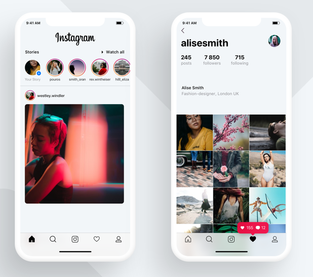
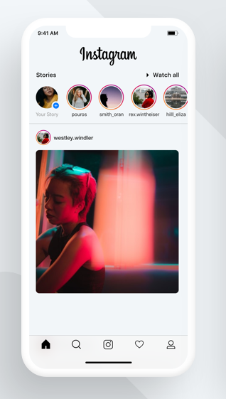
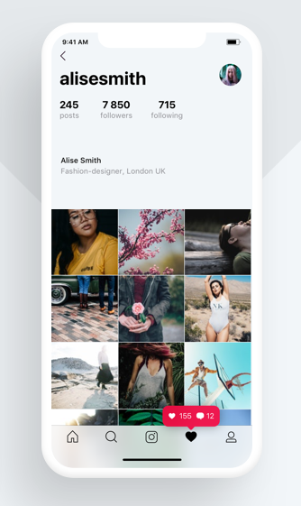

# Developer Assessment

Referencing the designs below, create an iOS application that mimics the functionality of Instagram.

## Requirements

- Develop two screens: a screen for the photo feed (referred herein as "Photo Feed"), and a screen for a user profile (referred herein as "Profile").
- Create a separate branch before making your changes.
- Frequently commit your changes to GIT, with proper messages on each commit.
- Photo Feed: Use dummy photos for each of the user profile pictures.
- Photo Feed: Profile photos should be unique.
- Photo Feed: The profile photo list should be horizontally scrollable up to at least 15 pictures.
- Photo Feed: Tapping on a profile picture should change transition to the Profile screen.
- Photo Feed: The profile photo list itself should be fixed to the top of the screen, while the content beneath the list should be vertically scrollable.
- Photo Feed: Pull the photo list from https://picsum.photos/ (refer to "List images" to retrieve a randomized list of photos)
- Photo Feed: Load the photos into the feed upon load of the app and also on pull to refresh.
- Photo Feed: Randomize the user icons above each photo (feel free to reuse the same photos you used for the profile pictures)
- Photo Feed: User profile pictures within the feed should not be tappable.
- Photo Feed: Tapping on a photo should make it appear within a popup. Feel free to style this as you wish. The photo does not need to transition from the feed into the popup, you're free to load the image again.
- Profile: The profile screen is triggered when you click on a profile picture within the profile list above the content feed.
- Profile: Make sure that the profile picture that you tapped gets carried over to the profile screen.
- Profile: Each profile should have a unique name, number of followers, location, and number of following.
- Profile: Like the Photo Feed, pull photos using Picsum for the photos listed on the profile. The list should be vertically scrollable. Photos do not have to be tappable.
- Photo Feed + Profile: The tab bar below should have similar icons to the ones displayed in the screenshots.
- Photo Feed + Profile: Tapping on the icons within the tab bar should trigger a popup with text saying "Tab Bar Option"
- Photo Feed + Profile: Disregard the pink popup that appears over the heart icon, as you do not have to develop this.
- Colors should be the same hex/rgb values that appear within the screenshots
- Code should be well documented, with adequate comments explaining each function.

### PHOTO FEED:

### PROFILE FEED:

## Submitting
Once you have completed developing the application. Open a pull request https://github.com/dondreytaylor/instagram-test/pulls from your branch into master.

If you have any questions about the tech or design specifications or have submitted your application, please email dondrey@capway.co and cc: careers@capway.co.
